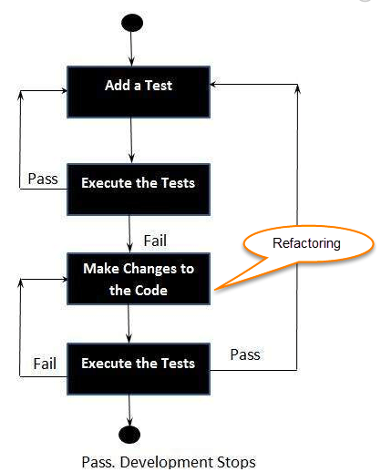

# Testing MR

"Its not hard to write a simple test, but to find out _what I want to test and how to check it_ - for that I need to write SOLID code without any code smell."

## Rules of unit testing
- Arrange: set up the environment and prepare a bunch of objects to run the unit under test
- Act: call the unit under test
- Assert: check that outputs and side effects of the unit under test are as expected

and...:

- Test Small Pieces of Code in Isolation
- Follow Arrange, Act, Assert
- Keep Tests Short
- Make Them Simple
- Cover Happy Path First
- Test Edge Cases
- Write Tests Before Fixing Bugs
- Make Them Performant
- Keep Them Stateless
- Write Deterministic Tests
- Use Descriptive Names
- Test One Requirement at a Time
- Favor Precise Assertions

[Source](https://leanylabs.com/blog/good-unit-tests/)

_Countering_ class was made **after** org.gfa.dusi.testing.countering.CounterTest:
## Test Driven Development
Test Driven Development (TDD) is a software development practice that focuses on creating unit test cases before developing the actual code. It is an iterative approach that combines programming, the creation of unit tests, and refactoring.

## Material Review

What is a 3rd party package?
- A package that is not part of the Java standard library
- It can be downloaded from the Internet and used in your project
- It is a bundle of classes and interfaces
- It can be used in your project

Why would we use a 3rd party package?

- 3rd party packages are usually more advanced than the Java standard library
- It can save us from writing a lot of code
- It can save us from writing bugs

What is a package manager?

- A tool that helps us to download and manage 3rd party packages
- It can be used to install, update, and remove packages
- The most popular package manager is Maven

How can we install a 3rd party package?

- We can install a 3rd party package by adding it to the pom.xml file
- We can also install a 3rd party package by using the Maven command line
- **We can also install a 3rd party package by using an IDE**

What is testing?
- Testing is the process of running a program or application with the intent of finding errors
- It is a critical part of the software development process
- It is a way to ensure that the code works as expected
- It is a way to ensure that the code does not break when we make changes to it
- It is a way to ensure that the code does not break when we use it in a different environment

Why do we create automated tests?
- Automated tests are tests that are run by a computer program
- They are faster than manual tests
- They are more reliable than manual tests
- They are more accurate than manual tests
- They are more consistent than manual tests
- They are more repeatable than manual tests
- They are more cost-effective than manual tests
- They are more efficient than manual tests

What is unit testing?
- Unit testing is a type of automated testing
- A unit test is a piece of code that tests a unit
- It is a way to test the smallest testable part of an application
- It is a way to test a class in isolation
- It is a way to test a method in isolation

What are the other type of tests?
- Integration tests
- Acceptance tests
- End-to-end tests
- Performance tests
- Security tests
- Regression tests

How can we avoid code duplication in our tests?
- We can avoid code duplication in our tests by using the Arrange, Act, Assert pattern

